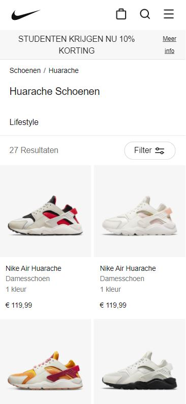
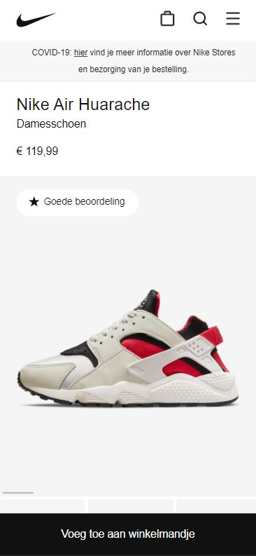
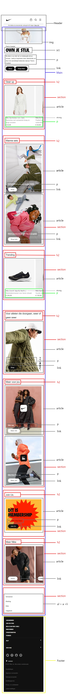
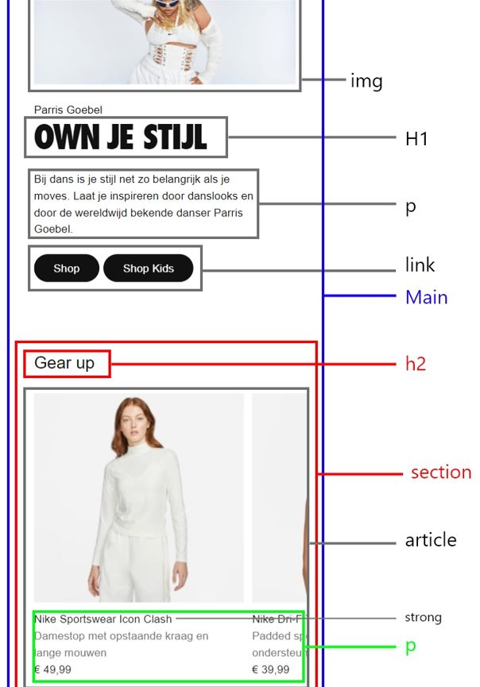
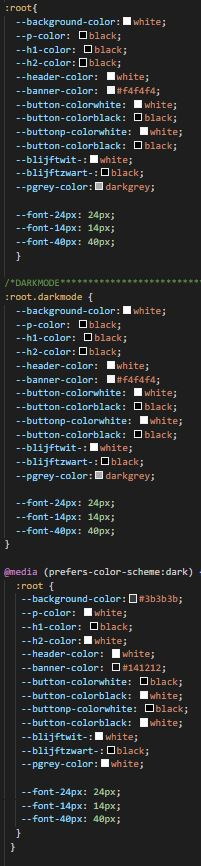
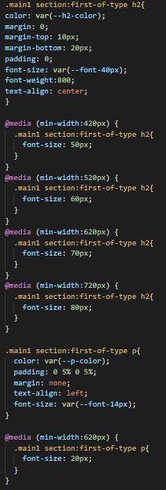

# Procesverslag
Markdown is een simpele manier om HTML te schrijven.  
Markdown cheat cheet: [Hulp bij het schrijven van Markdown](https://github.com/adam-p/markdown-here/wiki/Markdown-Cheatsheet).

Nb. De standaardstructuur en de spartaanse opmaak van de README.md zijn helemaal prima. Het gaat om de inhoud van je procesverslag. Besteedt de tijd voor pracht en praal aan je website.

Nb. Door *open* toe te voegen aan een *details* element kun je deze standaard open zetten. Fijn om dat steeds voor de relevante stuk(ken) te doen.

## Jij

uitwerken voor kick-off werkgroep

### Auteur:
Thijs van Ettinger 

#### Je startniveau:
Rood 

#### Je focus:
Surface plane/ responsive (kwam erachter dat dit mij beter af ging) (kies uit responsive óf surface plane)
 

## Je website

uitwerken voor kick-off werkgroep

### Je opdracht:
https://www.nike.com/nl
#### Screenshot(s) van de eerste pagina (small screen): 
hier de naam van de pagina  

#### Screenshot(s) van de tweede pagina (small screen):
hier de naam van de pagina  

 

## Breakdownschets (week 1)

uitwerken na afloop 2e werkgroep

### de hele pagina: 

### dynamisch deel: 

## Voortgang 1 (week 2)

 
Ik kon niet aanwezig zijn bij de eerste voortgang helaas. ik ben gewoon verder gegaan aan mijn site en ben al goed op weg. Ik vind het erg leuk, maar wel moeilijk dus ik probeer veel uit en kijk wat werkt en wat niet.

## Voortgang 2 (week 3)

In de tweede week van de voortganggesprekken was ik helaas ziek en kon ik er niet bij zijn. Ik baalde er, want had het voortgang gesprek daarvoor ook niet gehaald door andere omstandigheden. Ik ben in principe verder gegaan aan mijn site , maar begon op gegeven moment het overzicht een beetje te verliezen en had veel tijd nodig om bepaalde css voor elkaar te krijgen etc.

## Toegankelijkheidstest (week 4)

In de 4e week hebben we verschillende toegankelijkheidstesten gedaan. Daaruit kwamen een paar dingen naar voren waar je normaal niet aan zou denken. Een van de voorbeelden die ik had en ook geprobeerd heb te verbeteren was het contrast van sommige tekst op mijn site. Ik heb uiteindelijk een dark mode gemaakt die het contrast wat beter maakt voor mijn gevoel. Verder kwam ik erachter dat mensen met parkinson wat last zouden kunnen hebben met de knoppen die op mijn site staan. Die heb ik vervolgens wat uitvergroot. 

### Bevindingen
Lijst met je bevindingen die in de test naar voren kwamen:

1. Concentratieprobleem met ballon: kleinere teksten lastig te zien door contrast, klikken op kleinere buttons is lastig. 
2. blur bril en met vlekken: dikke letters zijn goed te lezen. 

#### Contrast met grote tekst.
Dit ging op zich al prima, maar heb ik vervolgens ook nog een dark modus voor gemaakt die het contrast veranderd. Ik vind het hierdoor persoonlijk ook fijner om te lezen. Ik ben zelf ook meer van van dark modus.

#### Knoppen moeilijk te klikken voor mensen met parkinson.
Ik heb eigenlijk simpel de buttons gewoon wat vergroot zodat het makkelijker is om erop te klikken.

## Voortgang 3 (week 4)

	Deze week had ik een gesprek met Sanne en de andere uit mijn groepje. Daarin is veel besproken wat mij ook verder heeft geholpen. ik heb hierdoor een mooiere foto casousel kunnen maken die in het midden snapt. Dat vond ik er erg mooi uitzien. Verder hebben we wat tips nog gekregen over stylesheets en de structuur van ons Html bestand. Dit heb ik verder geprobeerd aan te passen.

### Stand van zaken
Zoals ik hierboven al had beschreven had ik nog wat moeite met een carousel maken die op de x as zou navigeren. Dit is verder uitgelegd en uiteindelijk is het gelukt dus dat is top.

### Agenda voor meeting

| Nina           | Marijn de B.       | Thijs        | student 4        |
| ---            | ---                | ---          | ---              |
| xxxxxxxxxxxxxxx| xxxxxxxxxxxxxxxxxxx| Carousel punt| xxxxxxxxxxxxxxxxx|
| xxxxxxxxxxxxxxx| xxxxxxxxxxxxxxxxxxx| xxxxxxxxxxxxx| xxxxxxxxxxxxxxxxx|
| ...            | ...                | ...          | ...              |

### Verslag van meeting
hier na afloop snel de uitkomsten van de meeting vastleggen

- De structuur van het Html bestand nog bekijken.
- Het gebruik van columns en rows zijn nog een keer uitgelegd.
- Carouselpunt uitgelegd en de order van p's die bij de img horen binnen een carousel.

## Eindgesprek (week 5)

Ik heb het vooral gehad over een paar dingen die nog niet zo goed gingen. Ik was ook nog niet klaar met mijn site en gebruikte het gesprek dus vooral om meer te weten te komen. Verder heb ik lopen sparren met de docent over wat wellicht leuk zou zijn binnen mijn site. Uiteindelijk heb ik dus gebruik gemaakt van een dark modus binnen mijn site en heb ik de site meer responsive gemaakt.
Ik merkte achteraf dat responsiveness mij een stuk beter lag en dat ik wel snapte hoe het werkte. Ik vind coderen erg moeilijk en zie mezelf ook zeker niet als de beste, maar ik ben best trots op mijn eindresultaat. 

### Stand van zaken
hier dit ging goed & dit was lastig.

	Ik heb verschillende dagen gehad dat ik van alles aan het proberen was, maar er veel niet ''werkte'' en ik heb dagen gehad waarbij alles opeens in een keer goed ging. Dat is coderen bij mij in 1 oogopslag. Ik vind het super leuk, maar wel moeilijk. 

### Screenshot(s)

hier screenshot(s) van je eindresultaat

## Bronnenlijst

continu bijhouden terwijl je werkt

Nb. Wees specifiek ('css-tricks' als bron is bijv. niet specifiek genoeg).

1. https://www.allyproject.com/posts/how-to-hide-content
2. Navigatie span uitleg samen met Sharon gedaan.

